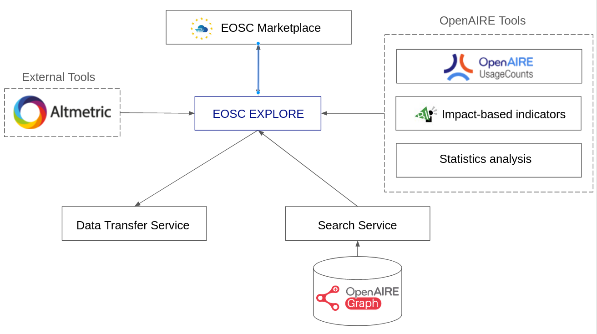

# EOSC EXPLORE

This project was generated with [Angular CLI](https://github.com/angular/angular-cli) version 7.3.10 and has been updated to 18.2.5.

## Install packages

Run npm install (maybe needs sudo), a script that will delete unused files from library will be run.

## Development server

Run `npm start` for a dev server. Navigate to `http://localhost:4400/`. The app will automatically reload if you change any of the source files.

## Build - CSR

Use the `npm run build-dev` for a development build. 
Use the `npm run build-beta` for a beta build. 
Use the `npm run build-prod` for a production build.

## Build - SSR

Use the `npm run build:ssr-dev` for a development build. 
Use the `npm run build:ssr-beta` for a beta build. 
Use the `npm run build:ssr-prod` for a production build.

## Run SSR

`npm run serve:ssr` will run the last server build.

## Webpack Analyzer

In order to analyze bundle size you can run `npm run webpack-bundle-analyzer`

## Running unit tests

Run `ng test` to execute the unit tests via [Karma](https://karma-runner.github.io).

## Running end-to-end tests

Run `ng e2e` to execute the end-to-end tests via [Protractor](http://www.protractortest.org/).

## System Architecture

Users can access the EOSC EXPLORE portal via the EOSC Marketplace portal when searching for Publications, Data, Software and Other Research Products.

The EOSC EXPLORE portal serves detailed pages for specific research products, providing an overview of all the metadata available in OpenAIRE Graph and the relationships among the entities of the graph, such as related research, supplementary research, funding projects, related organizations and data sources. Users can navigate through the different entities of OpenAIRE Graph by following the relationships.

In the detailed pages of research data users can transfer files found in Zenodo and other sources in their own data storage, such as dcache or s3  using the Data Transfer Service.
Metrics, indicators and charts, calculated by OpenAIRE or external tools, are also available in the detailed pages of EOSC EXPLORE.

The detailed pages share the same navigation bar with EOSC Marketplace for easy and quick navigation and users can be redirected easily back to the search page of EOSC Marketplace from which they entered EOSC EXPLORE.
